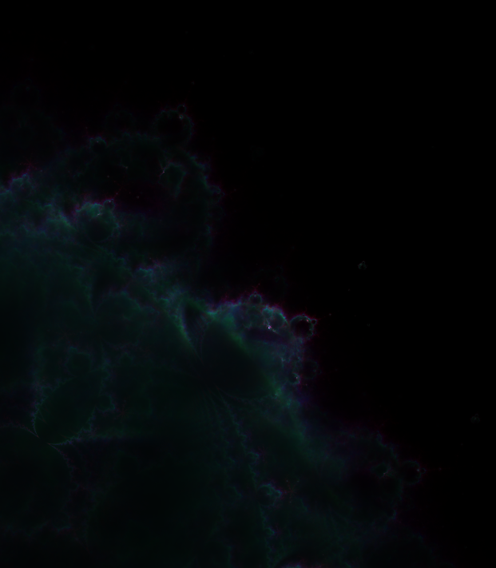
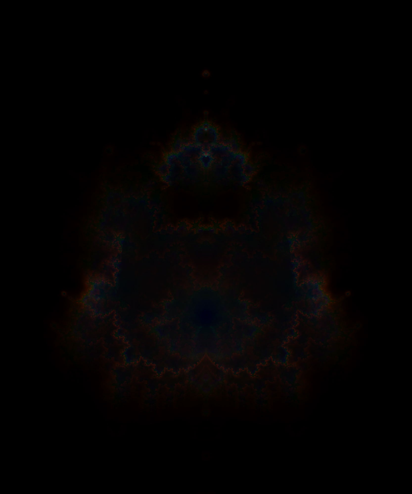

# budack
Generate beautiful figures based on the Mandelbrot fractal gost-points via parallel computing. 

([click to explore the rich details](https://raw.githubusercontent.com/Tugdual-G/budack/main/images_exemples/trajhd.png))

Run with mpiexec to compute and save the trajectories.

    mpiexec ./budack

The trajectories are written on disk as 8 bits per pixels binaries: 'trajectories.char'.
You can generate the image using ImageMagick for example, for a grid of 1000x833:

    magick convert -size 1000x833 -depth 8 GRAY:trajectories.char traj.png

Using ImageMagick's command-line utilities, you can also combine different trajectories. For example, R.char , G.char , and B.char:

    magick convert -size 1000x833 -depth 8 R:R.char G:G.char B:B.char -combine -gamma 1.2 -rotate 90 colors.png 

Which gives:

or,

Computing scheme :

- Generate random points close to the border of the Mandelbrot set.
    - These points are computed randomly with an 'auto-hint', the values of the first N points attract the probability distribution of the next point toward them. When N is small (N=100) this first part of computation is faster and the generated pictures presents some interesting random nuances.  
- Slightly offset these points by a binomial distribution.
- Compute their trajectories.
