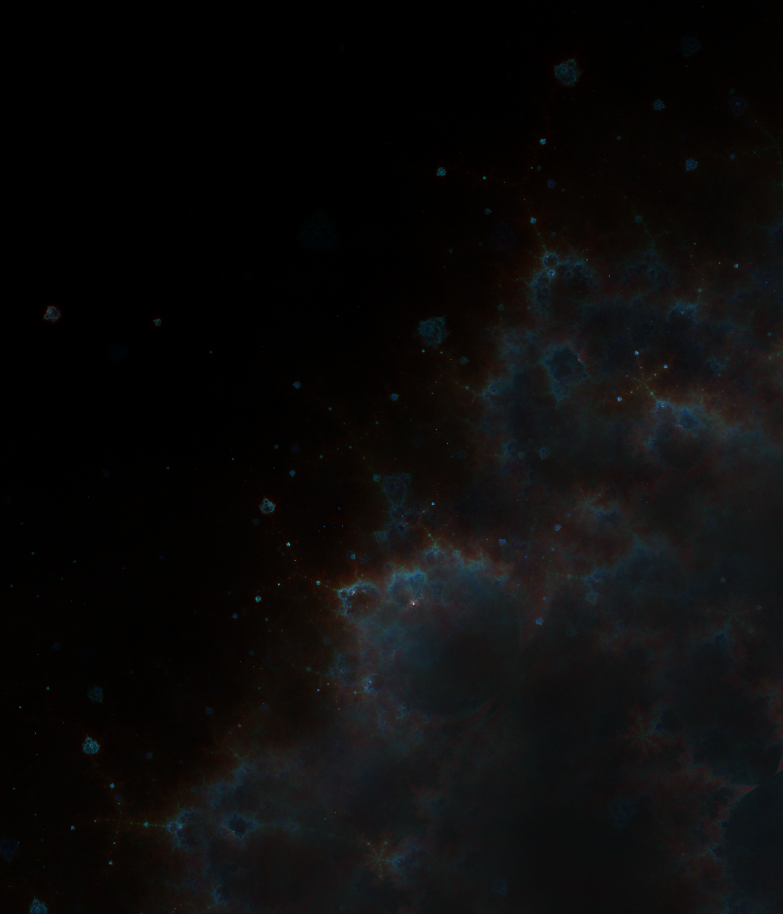

# budack
 **Parallel computation of the Mandelbrot set gost-points.**

([click to explore the details](https://raw.githubusercontent.com/Tugdual-G/budack/main/images_exemples/trajhd.png))

## Usage

The easiest way to run the computation is by using the script *exe.sh* which will also generate images. This script use ImageMagick to create PNG images and sxiv to open them. Editing the script allow to tune the parameters easily.

    ./exe.sh

Different combinations of colors will be generated.

You can compile the code by running make.

    cd core/
    make

**Note**   
Because of the lazy memory allocation by Linux kernel, the memory usage will start very low and grow as new pixels are visited by the trajectories. To avoid any surprise, the total allocated size for the arrays is shown at the beginning of the program, in practice the ram usage will be lower than the estimation.

## Requirements
- Open-MPI for parallel computing
- Running the script on 3 cores at least
    - If you only have one or two available cores, you may have to run the the computation using the oversubscribe option in mpiexec such as (the script *exe.sh* take care of this case),
 
            mpiexec --oversubscribe -n 3 budack [args]
    

- **Optionnal**
    - sxiv image viewer
    - ImageMagick, to create png pictures from the binary files.
     
## Computing scheme

- Generate random points close to the border of the Mandelbrot set.
    - These points are computed randomly with a normal distribution around the border of the Mandelbrot set and stored on disk for reuse. The positions of the first points attract the probability distribution of the next points toward them. 
- Slightly offset these starting points randomly by a binomial distribution.
- Compute the trajectories until sufficient density (points per pixel) is reached.
- The trajectories are written to disk as 8 bits grayscale binaries and 16 bits grayscale binaries without any header (i.e. 2 files are written to disk for each color channel : red, green and blue). The parameters are written to disk too as 'param.txt' . 

## Images processing
- Use ImageMagick to generate images from 8 bites grayscale.
- Use a gamma function on the 16 bits grayscale to enhance smoothly the trajectories, which are then turned to 8 bits grayscale to generate images from 3x8 bites rgb channels. See the script *gamma.sh* This script is mostly needed for high resolution images. 
   
**Snapshots:**

