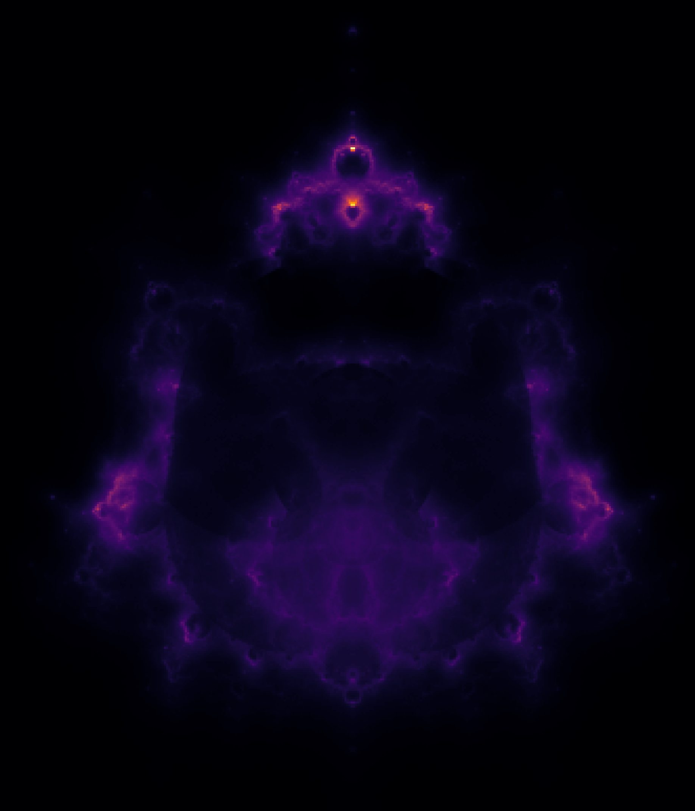

# budac
Generate beautifuls figures based on the Mandelbrot fractal via parallel cumputing.
Generate random points close to the border of the Mandelbrot set; then plot their trajectories.

Run with 'mpiexec ./budack' and display with python.
