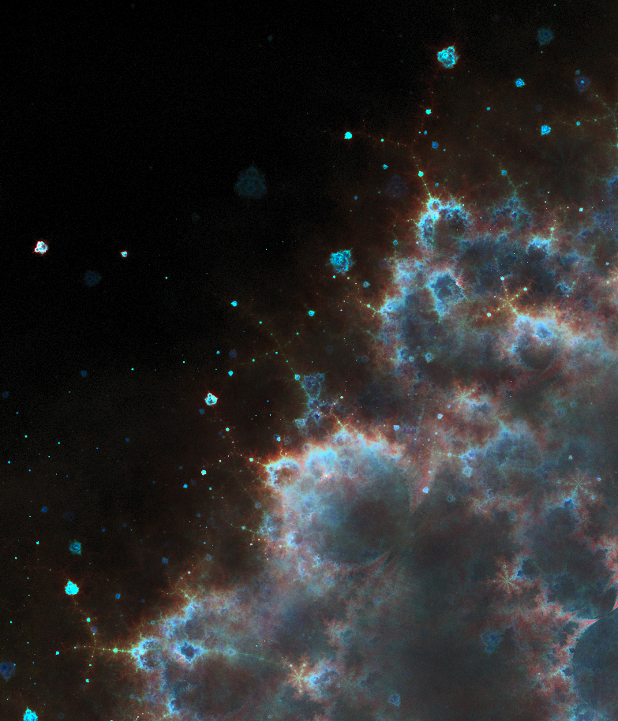
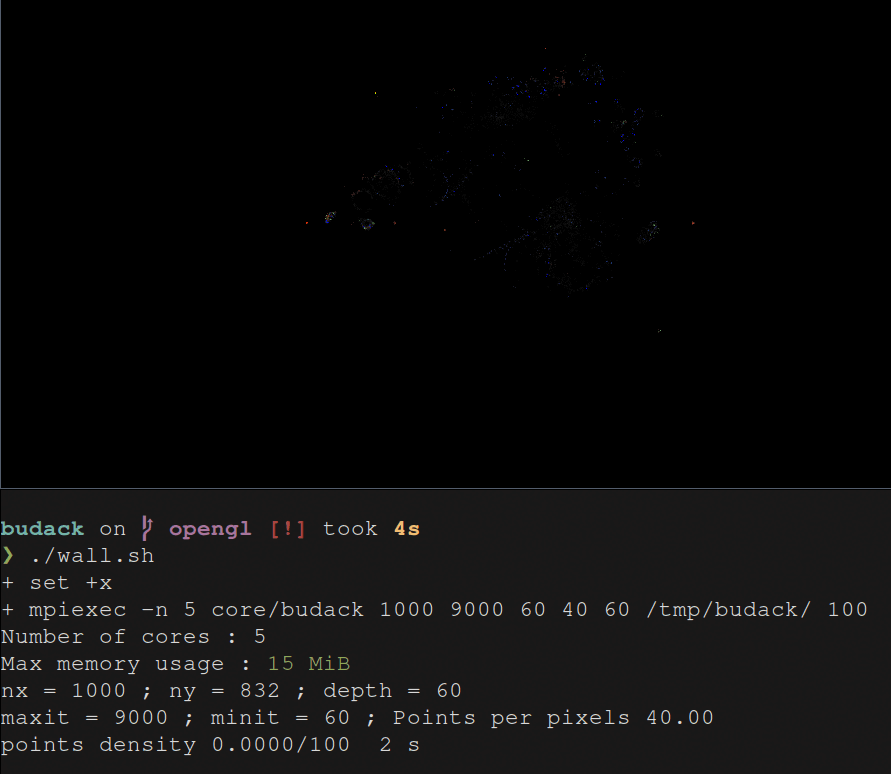

# budack
 **Real time parallel rendering of the Mandelbrot set gost-points.**

([click to explore the details](https://raw.githubusercontent.com/Tugdual-G/budack/main/images_exemples/trajhd.png))

## Presentation
The "budhabrot" is a lesser-known representation of the Mandelbrot set, consiting in trajectories of the points rather than their escape-times. 
This representation is much more computationally-intensive since, contrary to more traditional techniques,
it is not possible to use only the local information to render a region of the set.
Furthermore, plotting the trajectories also involve lots of random access writes. 

## Usage
Compile with,

    make -C core
        

Just try the default parameters by running (see requirements),

    ./exe.sh

The main program create a 16 bits per channel TIFF image to favor further processing.
ImageMagick is used to apply a sigmoidal contrast to the image, but this can be done with any editing software.
Editing the script allow to tune the parameters easily.

The project use tree different styles of implementation :
* The __main__ branch is implemented in a master/slave scheme, which is slower but more suited to large images ( > 8000 x 8000 px) and live rendering.
 You can navigate the fractal during computation using the arrow keys (for images larger than 2000px). This branch is optimized to run on 5 cores.

* The __gather__ branch uses a "compute then gather" scheme which is really fast but ends with huge data transferts in the case of large images, which take a toll on the RAM.

* The __shader__ branch is GPU-oriented, it was just an excuse to discover compute-shaders, since the GPU is not well suited to this problem due to the massive amount of random access writes, for now it's garbage. 

### Parameters
- The program use an uncommon parameter which greatly change the appearance of the generated images by fixing different depth zones for the starting points.
- The density of points per pixels control the noise of the images. 

You will also find parameters such as the size of the image, the maximum and minimum number of iterations.

The script exe.sh add more details to the function of each parameter in comments.

## Requirements
- Open-MPI for parallel computing
- libtiff c library
- OpenGL >= 4.6
- GLFW

**Optional**
- ImageMagick, to process and enhance the TIFF files.

**Note**
 If you only have one or two available cores, you may have to run the computation using the oversubscribe option in mpiexec such as (the script *exe.sh* take care of this case).
      
            mpiexec --oversubscribe -n 3 budack [args]
    
## Computing scheme

- Generate random points close to the border of the Mandelbrot set.
    - These points are computed randomly with a normal distribution around the border of the Mandelbrot set and stored on disk for reuse.
    The positions of the first points attract the probability distribution of the next points toward them. 
- Slightly offset these starting points randomly by a binomial distribution.
- Compute the trajectories until sufficient density (points per pixel) is reached.
- An output .tiff image is created. The parameters are written to disk too as 'param.txt'. 

**Note**   
Because of the lazy memory allocation by Linux kernel, the memory usage will start very low and grow as new pixels are visited by the trajectories. To avoid any surprise, the total allocated size for the arrays is shown at the beginning of the program, in practice the ram usage will be lower than the estimation.
